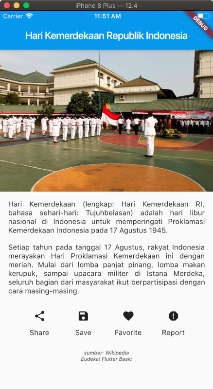

# Pembahasan Tugas 2 - OSG05
Tugas ke-2 kelas OSG05 dengan materi UI dan UX (layouting).

## Screenshot
.

---

Untuk menghindari error overflow atau tampilan yang berlebih dan membuat halaman atau tampilan dapat digulirkan (scrollable), bungkus widget utama (`Column`) dengan `SingleChildScrollView`.

```dart
SingleChildScrollView(
  child: Column(
    children: <Widget>[
      ContentDesc(),
      ContentActions(),
      ContentAbout(),
    ],
  ),
),
```

Lalu untuk membuat coding kita _Clean Code_ atau terlihat lebih rapih, kita pisahkan beberapa widget ke dalam kelas lain, seperti untuk ContentDesc, ContentActions, dan ContentAbout. 

```dart
class ContentDesc extends StatelessWidget {
  [...]
}

class ContentActions extends StatelessWidget {
  [...]
}

class ContentAbout extends StatelessWidget {
  [...]
}
```

Pada ContentDesc berisi untuk gambar dan deskripsi,

```dart
Column(
  children: <Widget>[
    Image.network(
      '...',
    ),
    Padding(
      padding: EdgeInsets.fromLTRB(16, 16, 16, 8),
      child: Text(
        '...',
        textAlign: TextAlign.justify,
      ),
    ),
    Padding(
      padding: EdgeInsets.fromLTRB(16, 8, 16, 8),
      child: Text(
        '...',
        textAlign: TextAlign.justify,
      ),
    ),
  ],
);
```

Lalu untuk ContentActions berisi aksi-aksi seperti share dan lainnya,

```dart
Padding(
  padding: EdgeInsets.fromLTRB(16, 8, 16, 16),
  child: Row(
    mainAxisAlignment: MainAxisAlignment.spaceEvenly,
    children: <Widget>[
      Column(
        children: <Widget>[
          IconButton(
            icon: Icon(Icons.share),
            onPressed: () {},
          ),
          Text('Share'),
        ],
      ),
      Column(
        children: <Widget>[
          IconButton(
            icon: Icon(Icons.save),
            onPressed: () {},
          ),
          Text('Save'),
        ],
      ),
      Column(
        children: <Widget>[
          IconButton(
            icon: Icon(Icons.favorite),
            onPressed: () {},
          ),
          Text('Favorite'),
        ],
      ),
      Column(
        children: <Widget>[
          IconButton(
            icon: Icon(Icons.report),
            onPressed: () {},
          ),
          Text('Report'),
        ],
      ),
    ],
  ),
);
```

Terakhir untuk ContentAbout berisi tentang apkikasi

```dart
Padding(
  padding: EdgeInsets.all(8),
  child: Text(
    'sumber: Wikipedia\nEudeka! Flutter Basic',
    textAlign: TextAlign.center,
    style: TextStyle(
      fontSize: 10,
      fontStyle: FontStyle.italic,
    ),
  ),
);
```

Untuk _source code_ lebih lengkap bisa coba lihat [disini](https://github.com/eudeka/osg05-task2).

---

## Online Study Group Eudeka!
Salah satu program dari [Eudeka!](https://www.eudeka.id) untuk belajar secara full online via Whatsapp/Telegram dan Google Classroom, dengan para praktisi handal di bidangnya. Selain itu juga kamu dapat berkesempatan untuk memperluas koneksimu dengan peserta lain.

## OSG05 - Flutter Basic
Dengan jangka waktu lebih kurang 2 bulan, peserta diharapkan dapat mengenal dan membuat aplikasi simple Flutter dengan menggunakan data dari internet (API).

## Cara Mendaftar Online Study Group
Untuk pendaftaran kelas selanjutnya, silahkan kunjungi atau hubungi kami di dawah ini.

## Info Lebih Lengkap
Website : [www.eudeka.id](https://www.eudeka.id).  
Twitter: [@EudekaID](https://twitter.com/EudekaID).  
Telegram : [@eudekainfo](https://t.me/eudekainfo).  
Instagram : [@eudeka.id](https://instagram.com/eudeka.id).  
WhatsApp : [0895351577557](https://wa.me/62895351577557).  
Email : [info@eudeka.id](mailto:info@eudeka.id).  

###### tags: `Samples` `Eudeka` `OSG05`
